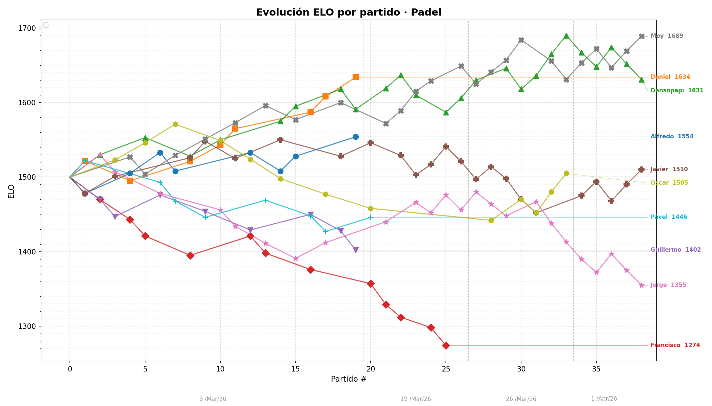

# Padel ELO

Sistema de ranking ELO para torneos de pádel de dobles. Calcula y visualiza la evolución del rating de cada jugador a lo largo de las sesiones.

---

## ¿Qué es ELO?

ELO es un sistema de rating que estima la fuerza relativa de los jugadores. Originalmente diseñado para ajedrez, funciona así:

- Cada jugador empieza con **1500 puntos**.
- Antes de cada partido, el sistema predice el resultado en base a la diferencia de ratings entre equipos.
- Si ganas contra un rival mejor rankeado, **sumas más puntos** que si ganas contra alguien peor.
- Si pierdes contra alguien de menor rating, **pierdes más puntos**.
- Con el tiempo, el ELO converge hacia el nivel real de cada jugador.

### Cómo se calcula aquí

1. **Rating de equipo**: se promedia el ELO de los dos jugadores del equipo.
2. **Probabilidad esperada** usando la fórmula estándar:

   ```
   E(A) = 1 / (1 + 10^((ELO_B - ELO_A) / 400))
   ```

3. **Multiplicador por margen**: una victoria 5-0 pesa más que una 3-2.

   ```
   multiplicador = 1 + (diferencia / total_games) × 0.5
   ```

4. **Delta ELO** aplicado a cada jugador del equipo:

   ```
   Δ = K × multiplicador × (resultado - esperado)
   ```

   Donde `K = 40` (factor alto porque hay pocos partidos).

---

## Cómo correr el proyecto

### Requisitos

- Python 3.10+
- `matplotlib`

```bash
pip install matplotlib
```

### Ejecutar

```bash
python3 padel_elo.py
```

---

## Output

El script produce dos tipos de salida:

### 1. Consola — Rankings por sesión

Después de cada fecha de juego, muestra una tabla con el ELO actualizado, la variación respecto a la sesión anterior, y el resultado del día (victorias/derrotas):

```
======================================================================
📅  RANKING DESPUÉS DE: 3/Mar/26  (10 jugadores)
======================================================================
#    Jugador          ELO      Δ   Día W   Día L  Asistió
-------------------------------------------------------
1    Moy             1605    +105       7       3       ✅ 🥇
2    Daniel          1583     +83       6       4       ✅ 🥈
...
```

### 2. Consola — Ranking final acumulado

Tabla global con ELO total, victorias, derrotas, porcentaje de victorias, partidos jugados y sesiones asistidas:

```
======================================================================
🏆  RANKING ELO FINAL - PADEL (ACUMULADO)
======================================================================
#    Jugador          ELO     W    L   Win%  Partidos  Sesiones
--------------------------------------------------------------
1    Moy             1605    13    7  65.0%        20         2 🥇
...
```

### 3. Consola — Estadísticas adicionales

- Mayor subida y bajada de ELO total.
- Evolución numérica por jugador: `1500 → 1563 → 1605`.

### 4. Gráfica — `elo_evolution.png`

Una gráfica de líneas con la evolución del ELO de cada jugador sesión a sesión, guardada automáticamente en el directorio del proyecto.



---

## Resultados

Los resultados de los partidos están registrados en el siguiente spreadsheet:

[📊 Resultados Padel](https://docs.google.com/spreadsheets/d/1lnZlkSRlh7VjVhLlCfvkIZWXSgJMMqoK693xAvxxh3o/edit?gid=408319547#gid=408319547)

---

## Agregar partidos

Los resultados están en la variable `MATCHES_CSV` dentro del script. Cada fila sigue este formato:

```
Fecha,Ronda,Pista,Equipo 1,Equipo 2,Marcador
19/Mar/26,1,1,Jugador A / Jugador B,Jugador C / Jugador D,4 - 2
```

Agrega nuevas filas al final del CSV para incluir sesiones futuras.
